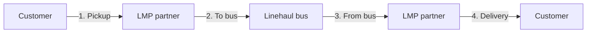

# Patwadi — For the Team

A plain-language guide to what the Patwadi app does, who uses it, and how the main flows work. No technical background required.

For engineering detail, see `PATWADI_APP_DOCUMENTATION.md`. For product rules and launch decisions, see `PATWADI_LAUNCH_ARCHITECTURE.md`.

*Last updated: June 2026 (launch prep, operator onboarding model)*

---

## What Patwadi is

Patwadi is an **overnight intercity parcel service** for India. Customers send packages between cities on **fixed corridors** (e.g. Delhi ↔ Chandigarh). Parcels move on **partner buses and local delivery partners**, not on Patwadi-owned trucks.

**What we sell:** certainty and trust — customers know where their parcel is in the journey, and every handoff is verified.

**What we are not (at launch):** a same-day courier app, a depot finder, or a public “routes map.” Customers learn whether we serve their lane **when they book**, not from a separate coverage screen.

---

## Who uses the app

Everyone uses **one mobile app**, but they see different screens after login.

| Who | What they do |
|-----|----------------|
| **Customer** | Book a parcel, pay, track status, contact support |
| **LMP operator** | “Last mile” partner — picks up from customer, delivers to customer, hands to/from the bus |
| **Linehaul operator** | Bus conductor — runs the intercity trip, carries parcels between cities |
| **Patwadi admin / ops** | Handles exceptions, recoveries, trip issues, corridor setup, operator approval (mostly back-office today) |

**Important:** Customers can **sign up in the app**. Operators **cannot** — they are onboarded through the **Patwadi website**, verified by ops, then given login credentials.

---

## How a parcel travels (the big picture)

Think of four legs and three kinds of people:

1. **Customer → LMP** — Partner collects the parcel at pickup address.  
2. **LMP → Linehaul** — Parcel is handed to the conductor at the bus.  
3. **Linehaul → LMP** — Parcel leaves the bus at destination city.  
4. **LMP → Customer** — Partner delivers to dropoff address.

At **every handoff**, the person giving the parcel and the person receiving it must complete a **short verification** in the app (see “Trust & handoffs” below). That creates a permanent record of who had the parcel when.

---

## Corridors — where we operate

A **corridor** is a supported lane between two cities (e.g. Delhi to Chandigarh). Patwadi only accepts bookings whose pickup and dropoff fall on an **active corridor**.

- **For customers:** If their addresses don’t match a live corridor, they see: *“We’re not live on this corridor yet.”* There is no separate “Routes & Coverage” or “Depots” screen at launch — coverage is checked during booking only.
- **For operators:** Each operator is approved for **specific corridors only**. A linehaul conductor creating a trip only sees corridors ops has assigned to them — not every route in the system.
- **For ops:** New corridors can be turned on or off in the admin dashboard without releasing a new app version.

**Launch corridors** (examples): Delhi–Chandigarh, Delhi–Manali, Mandi–Chandigarh, Shimla–Chandigarh, Shimla–Delhi, Mumbai–Pune. More can be added as the network grows.

---

## Customer features

### Booking a parcel

1. **Send Parcel** — Enter package details (weight, size, contents).  
2. **Pickup & dropoff** — Search addresses; save favorites in **Address book** (Home, Work, custom labels).  
3. **Price** — See an estimate before paying.  
4. **Pay** — Checkout via Razorpay (UPI, cards, etc.).  
5. **After payment** — Customer lands on **tracking** for that shipment.

Guests can start booking without an account; they can create an account at checkout without losing their entered details.

### Tracking

Customers see a **simple 5-step status**, not internal jargon:

| Status shown | Meaning (plain language) |
|--------------|-------------------------|
| **Booked** | Paid and registered; pickup not yet confirmed |
| **Picked up** | A partner has the parcel from the customer |
| **In transit** | On the bus between cities |
| **Out for delivery** | With delivery partner near destination |
| **Delivered** | Handed to recipient (with delivery photo when complete) |
| **Delivery exception** | Something needs ops attention; team is resolving |

Customers see **dates**, not exact timestamps or operator names. At **Delivered**, they can see the **proof-of-delivery photo**.

They do **not** see: bus numbers, conductor phone numbers, internal trip IDs, or a step-by-step custody log in the app (a detailed report can be prepared on request via support).

### Other customer tools

- **My Parcels** — List of past and active shipments.  
- **Notifications** — Activity feed based on status changes (in-app, not push alerts yet).  
- **Settings** — Language, address book, account deletion, log out.  
- **Support** — WhatsApp link with order context pre-filled (customer chooses issue type, then sends the message).

### Languages

The operator dashboard and key strings support **English, Hindi, Punjabi, Tamil, Telugu, Marathi, and Gujarati**. Most customer screens are still primarily English; language coverage is expanding.

---

## Operator features

### Two operator types (never both)

| Type | Role in the journey |
|------|---------------------|
| **LMP** | Local pickup and delivery around cities |
| **Linehaul** | Intercity bus trip between corridor endpoints |

Each person is **either** LMP **or** linehaul for Patwadi — not both on one account.

### How operators join Patwadi

1. Applicant completes **KYC on the Patwadi website** (identity, documents, payment details, emergency contact, operator type, desired corridors).  
2. **Ops reviews** documents and approves or rejects.  
3. Ops **creates the account** in the back office and assigns **approved corridors**.  
4. Operator receives **login credentials** and signs into the **same app** as customers.

If someone signs in before approval, or if their account is suspended, they see an **“Operator access pending”** screen with a link to contact ops — not the normal operator home.

**Ops tracks two gates:**

- **Approval** — Has Patwadi verified this person?  
- **Active status** — Are they currently allowed to work (vs suspended or inactive)?

Both must be “yes” before they can accept jobs or publish trips.

### LMP operator — day to day

- **Parcels** tab — Shipments assigned to them for pickup or delivery.  
- **Confirm handoff** — When handing a parcel to the next person (customer, conductor, or another LMP), they enter a **4-digit code** and take a **photo** as proof.  
- **My Handoff Codes** — Codes others need to hand *to* them.  
- **Home** — Summary and shortcuts; alerts when new work is available.

### Linehaul operator — day to day

- **Create / publish trip** — Choose an **approved corridor**, bus details, driver name and phone, departure and arrival times, and a **photo of the bus** before the trip goes live.  
- **My Trips** — List of their trips (draft, live, completed, etc.).  
- **Trip detail** — See parcels on the bus, add a **co-conductor** if someone else will help mid-route, or **request a transfer** if another conductor must take over.  
- **Parcels** tab — Parcels available to attach to their open trip (matching corridor).  
- **Compliance reminders** — The app can prompt if handoffs are overdue or if arrival needs a short extension when still far from destination.

**Extra trips:** Normally one trip per conductor per calendar day. A second trip the same day needs **admin approval** before it can go live.

---

## Trust & handoffs (why codes and photos matter)

Patwadi’s trust model: **every time responsibility changes, it is recorded.**

1. The **sender** starts handoff in the app.  
2. The system gives a **one-time 4-digit code** to the **receiver** (visible in their app).  
3. The sender enters the code and **must attach a photo**.  
4. Only then does the parcel officially move to the next stage — and the customer’s tracking updates.

This applies across all four legs (customer ↔ LMP ↔ bus). Internal handoff photos are for **ops and disputes**; customers mainly see the **final delivery photo**.

---

## Trip transfers and co-conductors (linehaul)

Sometimes the bus trip needs flexibility:

- **Co-conductor** — Another approved linehaul operator is added to help on the same trip (e.g. last-minute relief).  
- **Transfer** — The primary conductor asks another approved operator to **take over** the trip. The other person must **accept** within a time window. Ops may be notified if the system flags something unusual (location, timing, repeated transfers).

Transfers can happen even while the bus is en route — that is intentional for real-world breakdowns or no-shows.

---

## When something goes wrong

### Customer sees “Delivery exception”

The label is the same whether the issue is a failed handoff code, a cancelled trip, or a parcel stuck in recovery. The message tells them **the team is resolving it** — not the technical cause.

### Emergency recovery (ops)

If a parcel was already on a bus (custody recorded) but the trip cannot continue, ops opens a **recovery** workflow: find another trip or mark the parcel unrecoverable. The customer stays in “exception” until ops resolves it.

### Admin dashboard (ops)

From one login (admin accounts), ops can:

- Browse **all parcels** and unblock stuck ones.  
- Manage **recovery queue** — reassign parcels to another trip or close as unrecoverable.  
- Review **flagged transfers** (unusual conductor changes).  
- Oversee **all trips** — cancel a trip, remove a parcel from a trip, approve an extra trip.  
- Manage **corridors** — activate routes, add new city pairs.

**Not in the app yet at launch:** a full “pending operator” queue with document viewer — that is done manually in the database for now.

---

## Payments

- Customers pay **in the app** at booking (Razorpay).  
- A booking is not fully in the system until **payment succeeds**.  
- Refunds and cancellation policy for unrecoverable parcels follow existing order/support processes (handled by ops, not fully automated in-app).

---

## Support

There is **no in-app chat**. Customers and operators open **WhatsApp** to Patwadi support with a **pre-filled message** (order ID, corridor, current step, issue type). The user still taps Send in WhatsApp — Patwadi does not auto-send messages.

Issue types include things like “Where is my parcel?”, “Payment problem”, and “Request detailed shipment report.”

---

## Privacy & accounts

- Customers can **delete their account** in Settings (required for app store policies).  
- Operators and customers use the same login screen; routing depends on account type.  
- **Guest browsing** is allowed for exploring send-parcel flow; account needed to pay and track long-term.

---

## What is intentionally hidden or simplified at launch

| Not shown to customers | Why |
|----------------------|-----|
| Depots list | Not part of launch product |
| Public routes / coverage map | Coverage checked during booking only |
| Operator names, bus plates, trip IDs | Tier-1 tracking stays simple |
| Self-service operator signup | Quality and KYC controlled via website + ops |

---

## Glossary

| Term | Plain meaning |
|------|----------------|
| **Corridor** | A supported city-to-city lane we ship on |
| **LMP** | Local partner for pickup/delivery in a city |
| **Linehaul** | Intercity bus leg |
| **Handoff** | Moment when one person gives the parcel to the next |
| **Custody** | Who is officially responsible for the parcel at a given time |
| **Trip** | A scheduled bus run on one corridor |
| **Recovery** | Ops process when a parcel is stranded after a trip problem |
| **KYC** | Identity and compliance documents for operators |

---

## Related documents

| Document | Audience |
|----------|----------|
| `PATWADI_FOR_TEAM.md` (this file) | Everyone on the team — product, ops, support, business |
| `PATWADI_LAUNCH_ARCHITECTURE.md` | Product and engineering — rules and launch decisions |
| `PATWADI_EXECUTION_PLAN.md` | Engineering — how features were built, session by session |
| `PATWADI_APP_DOCUMENTATION.md` | Engineering — screens, database, technical map |
| `docs/linehaul-ux-issues.md` | Engineering / QA — operator UX bug log |

---

*Questions or corrections? Update this doc when launch behavior changes so support and ops stay aligned with the app.*
