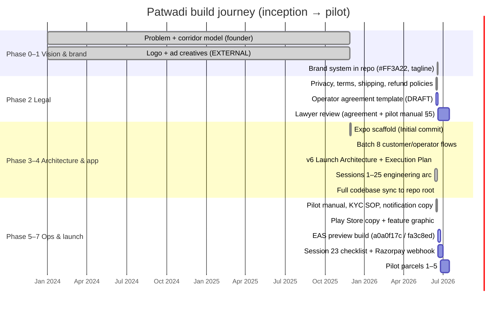
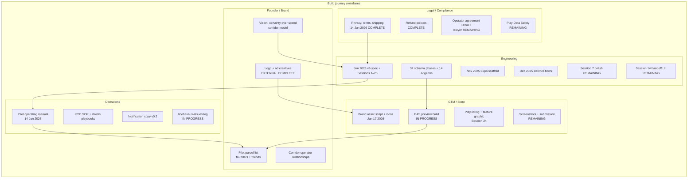
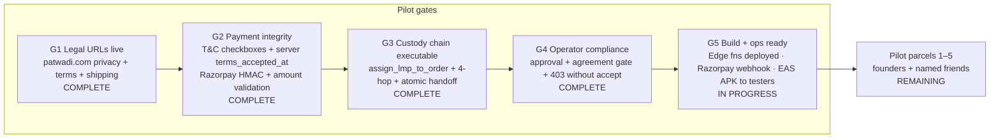

# Patwadi Build Journey — Inception to Pilot

A founder- and newcomer-facing map of everything built to get Patwadi from idea to first pilot parcels: brand, legal, product architecture, engineering, operations, and go-to-market.

**What Patwadi is:** Overnight intercity parcel delivery for North India on fixed **corridors** (e.g. Delhi ↔ Chandigarh). Parcels move along verified corridor linehaul with local pickup/delivery partners through a **four-hop custody chain**: customer → LMP → linehaul → LMP → customer. Every handoff is verified in-app (code + photo).

**Status legend:** `COMPLETE` · `IN PROGRESS` · `EXTERNAL` (done outside repo) · `REMAINING`

**How to read this doc:** Git history is sparse (7 commits); the detailed engineering arc is Sessions 1–25 in `PATWADI_EXECUTION_PLAN.md` (Jun 2026). Dates below combine git milestones, doc effective dates, and session completion notes.

---

## Phase overview

| Phase | Name | When | Status |
|-------|------|------|--------|
| **0** | Inception & vision | Pre-2025 → codified 12 Jun 2026 | COMPLETE |
| **1** | Brand & identity | EXTERNAL at inception; in-repo Jun 2026 | COMPLETE (final logo/ads EXTERNAL) |
| **2** | Legal & compliance foundation | Jun 2026 (effective 14 Jun) | MOSTLY COMPLETE |
| **3** | Product architecture | v6 spec 12 Jun 2026; schema phases 2–25 | COMPLETE |
| **4** | App build | Nov–Dec 2025 scaffold → Sessions 1–25 Jun 2026 | MOSTLY COMPLETE |
| **5** | Operations & trust | Jun 2026 docs + in-app enforcement | COMPLETE (lawyer review REMAINING) |
| **6** | Go-to-market | Session 24 + EAS config Jun 2026 | IN PROGRESS |
| **7** | Pilot launch gates | Today | IN PROGRESS |

---

## Diagram 1 — Horizontal timeline (inception → pilot)

---

## Phase 0 — Inception & vision `COMPLETE`

**Problem:** Intercity parcels in North India rely on informal corridor networks with no verified custody chain. Customers lack certainty; operators lack a shared operating layer.

**Solution shape (corridor model):**
- Fixed **corridors** between city pairs — not a depot finder or same-day courier.
- **Custody events** = legal/operational truth (immutable handoffs).
- **Layered truth:** custody > trips > WhatsApp coordination > GPS contingency.
- **Brand promise:** certainty and trust, not speed (*"Patwadi sells certainty, not speed"*).

**Evidence in repo:**
- Early codebase analysis: `PRODUCT_DIRECTION_ANALYSIS.md` (2024) — stubbed customer journey, Mapbox, pricing placeholders.
- Product thesis codified: `PATWADI_LAUNCH_ARCHITECTURE.md` §1 (v6, 12 Jun 2026).
- Plain-language overview: `PATWADI_FOR_TEAM.md`.

**Launch corridors (examples):** Delhi–Chandigarh, Delhi–Manali, Mandi–Chandigarh, Shimla–Chandigarh, Shimla–Delhi, Mumbai–Pune.

---

## Phase 1 — Brand & identity `COMPLETE` (logo/ads `EXTERNAL`)

### EXTERNAL (founder — complete, not in repo)
| Item | Status |
|------|--------|
| Final logo | **EXTERNAL COMPLETE** |
| Ad creatives (marketing) | **EXTERNAL COMPLETE** |
| Corridor network / operator relationships | **EXTERNAL** (ops, not code) |

### In-repo brand system `COMPLETE`
| Item | Location | Notes |
|------|----------|-------|
| Primary red `#FF3A22` | `src/theme/colors.ts`, legal HTML headers | Brand CTA color |
| Tagline **"Every parcel. Verified."** | `scripts/generate-brand-assets.mjs` → `assets/feature-graphic.png` | Play Store feature graphic |
| App icons + splash | `assets/icon.png`, `adaptive-icon.png`, `splash-icon.png` | Generated Jun 17 2026 (`f43033d`) |
| Notification voice | `docs/notification-copy-sheet.md` v0.2 | Humanity → Recognition → Trust |
| Core brand promise (notifications) | Same doc | *"Delivery that works around real life."* |
| Play Store short description (recommended A) | `docs/play-store-listing.md` | *"Intercity parcel delivery on verified corridors. Every handoff verified."* |

**Git:** `f43033d` (2026-06-17) — `scripts/generate-brand-assets.mjs` + sharp dependency.

---

## Phase 2 — Legal & compliance foundation `MOSTLY COMPLETE`

| Document | Effective / updated | Live URL | Status |
|----------|---------------------|----------|--------|
| Privacy policy | June 2026 | https://patwadi.com/docs/privacy-policy | **COMPLETE** (lawyer review noted in HTML) |
| Terms of Service | 14 Jun 2026 | https://patwadi.com/terms.html | **COMPLETE** |
| Terms (long form) | 14 Jun 2026 | `docs/terms-of-service.html` | **COMPLETE** |
| Shipping policy | 14 Jun 2026 | https://patwadi.com/shipping.html | **COMPLETE** |
| Refund/dispute (customer) | 14 Jun 2026 | `docs/refund-dispute-policy-customer.md` | **COMPLETE** |
| Refund/dispute (internal) | 14 Jun 2026 | `docs/refund-dispute-policy-internal.md` | **COMPLETE** |
| Operator agreement | DRAFT | In-app links to terms; template in repo | **REMAINING** — lawyer review |
| Play Data Safety form | — | Play Console | **REMAINING** — must reflect Phase 4 permissions |
| T&C before pay (in-app) | Session 23 | `ConfirmOrderScreen` + `phase23_terms_accepted.sql` | **COMPLETE** |
| Operator agreement gate | Session 25 | `OperatorAgreementScreen` + `phase25_operator_agreement.sql` | **COMPLETE** (template still DRAFT) |

**In-app enforcement:** Checkboxes on checkout; `terms_accepted_at` set server-side; operators blocked until agreement RPC accepted.

---

## Phase 3 — Product architecture `COMPLETE`

**Source of truth:** `PATWADI_LAUNCH_ARCHITECTURE.md` v6 (12 Jun 2026, supersedes v1–v5).

| Pillar | What was defined |
|--------|------------------|
| **Custody model** | `CustodyEvent` chain; `deriveParcelState()` — never trust legacy `Order.status` |
| **4-hop chain** | customer→LMP→linehaul→LMP→customer; code + photo at every handoff |
| **Roles** | `customer` \| `lmp` \| `linehaul`; admin via `admin_profiles` (not a profile role) |
| **Corridors** | DB table (`phase6_corridors.sql`); admin on/off without app release |
| **Linehaul trips** | Draft→open→closed→completed; co-conductor, transfer risk flags, emergency recovery (§13) |
| **Customer UX (§9)** | 5-stage simplified tracker; WhatsApp support deep links (§10) |
| **Operator onboarding (§20)** | Website KYC → admin creates user; app gates on `approval_status` + `operator_status` |
| **Phase 4 GPS (§19)** | Foreground trip-window tracking; `location_samples` + `sync-location-samples` |

**Schema evolution (32 files in `supabase/schema/`):**

| Schema phase | Theme |
|--------------|-------|
| `profiles.sql`, `mvp_custody.sql` | MVP roles, orders, custody_events, handoff_codes |
| `phase2`–`phase5` | Trips, timers, limits, admin recovery |
| `phase6`–`phase13` | Corridors DB, operator parcels, transfer acceptance, trip coverage |
| `phase14`–`phase17` | Saved addresses, profile identity, operator onboarding model |
| `phase20`–`phase25` | Security hardening, payments, custody location, terms, packaging, operator agreement |

**Infrastructure `COMPLETE`:**
- Supabase **patwadi-dev:** `wvxyaqqlqwbbpkgvrali.supabase.co`
- **14 edge functions** (handoff, payments, admin, GPS sync)
- Mapbox geocoding (`EXPO_PUBLIC_MAPBOX_TOKEN`)
- Razorpay via edge functions + `react-native-razorpay`
- Storage: `custody-proofs` bucket + RLS
- Domain: **patwadi.com** (legal URLs + privacy)

---

## Phase 4 — App build `MOSTLY COMPLETE`

### Pre-v6 scaffold (git milestones)

| Milestone | Date | What shipped |
|-----------|------|--------------|
| Initial commit | 2025-11-28 | Expo + RN shell |
| Batch 8 | 2025-12-07 | Auth context, parcel screens, ConfirmOrder expansion, Mapbox dropoff, camera measure UI |
| Codebase sync | 2026-06-17 | Full `src/`, Supabase, docs, team guides at repo root |

### v6 execution arc (Sessions 1–25, Jun 2026)

Map sessions to **product areas** (not just numbers):

| Area | Sessions | Status |
|------|----------|--------|
| Foundation: edge fns, corridor_key, logout | 1, 1.5 | COMPLETE |
| Trips, RLS, transfers, recovery | 2–5 | COMPLETE |
| Customer tracker + WhatsApp support | 6 | COMPLETE |
| Operator trip UI + Admin Phase 2 UI | 8, 9, 8.5 | COMPLETE |
| Home + notifications feed | 6b | COMPLETE |
| Corridors DB + admin tab | 10 | COMPLETE |
| GPS / location samples | 11 | COMPLETE |
| Auth UX, empty states, deletion, offline | 12a–16 | COMPLETE |
| Operator onboarding model (§20) | 17 | COMPLETE |
| OTP, LMP gate, corridor copy fixes | 18 | COMPLETE |
| Store compliance, package ID, privacy URL | 19 | COMPLETE |
| Security: RLS, atomic handoff, delete-account | 20 | COMPLETE |
| Payment integrity + webhook | 21 | COMPLETE |
| 4-hop ordering + LMP assign RPC | 22 | COMPLETE |
| Pre-build checklist (verification only) | 23 | **REMAINING** |
| Play assets + iOS EAS config | 24 | COMPLETE |
| Operator agreement gate | 25 | COMPLETE |
| Visual polish | 7 | **REMAINING** |
| Segmented handoff code input | 14 | **REMAINING** |
| Physical device: payment E2E + GPS smoke | 12 Part B | **IN PROGRESS** (partial) |

**Tech stack today:** React Native 0.81, Expo SDK 54, TypeScript, React Navigation 7, Supabase JS.

**Package ID:** `com.patwadi.app` (`app.config.js`).

---

## Phase 5 — Operations & trust `COMPLETE` (lawyer review `REMAINING`)

| Artifact | Status | Notes |
|----------|--------|-------|
| `docs/pilot-operating-manual.md` v0.1 | COMPLETE | Effective 14 Jun 2026; parcels 1–5 founders+friends |
| `docs/operator-kyc-sop.md` | COMPLETE | Website KYC → Supabase Table Editor workflow |
| `docs/notification-copy-sheet.md` v0.2 | COMPLETE | Push/in-app copy by journey stage; first-parcel CTA |
| `docs/linehaul-ux-issues.md` | IN PROGRESS | Living log (L-UX-13–22) |
| Claims / escalation playbooks | COMPLETE | Pilot manual §3; spreadsheet fields defined |
| In-app vs OPS-only matrix | COMPLETE | Pilot manual §2 |

**Key ops reality:** Pilot scope (who may book) is **OPS ONLY** — no invite code in app. Support: WhatsApp +91 80918 89969, 8am–10pm IST.

---

## Phase 6 — Go-to-market `IN PROGRESS`

| Item | Status |
|------|--------|
| `docs/play-store-listing.md` | COMPLETE |
| `docs/play-store-screenshots.md` (brief) | COMPLETE |
| `assets/feature-graphic.png` 1024×500 | COMPLETE |
| Store screenshots (actual PNGs) | **REMAINING** |
| `eas.json` preview APK + production AAB profiles | COMPLETE |
| EAS project ID in `app.config.js` | COMPLETE |
| EAS preview build `a0a0f17c` on commit `fa3c8ed` | **IN PROGRESS** (`newArchEnabled` fix) |
| iOS TestFlight build | **REMAINING** (profiles configured, build not run) |
| Closed testing (12 testers / 14 days) | **REMAINING** |
| Production AAB + Play submission | **REMAINING** |
| `docs/razorpay-dashboard-setup.md` | **REMAINING** (parked — webhook registration manual) |

---

## Diagram 2 — Swimlane: who built what

---

## Phase 7 — Pilot launch gates `IN PROGRESS`

Five must-haves before **pilot parcels 1–5** (`pilot-operating-manual.md` §1):

| Gate | Blockers |
|------|----------|
| G5 | Session 23 checklist not run; Razorpay webhook not registered (`docs/razorpay-dashboard-setup.md`); EAS build `a0a0f17c` in progress |
| Post-G5 | Store screenshots; lawyer review; closed testing track; pilot parcels |

---

## Session quick reference

| Sessions | Area | Status |
|----------|------|--------|
| 1–1.5 | Cleanup, edge functions, logout | COMPLETE |
| 2–5 | Trips, RLS, transfers, recovery | COMPLETE |
| 6, 6b | Customer tracker, home, notifications feed | COMPLETE |
| 7 | Visual polish | REMAINING |
| 8–11 | Operator/admin UI, corridors DB, GPS | COMPLETE |
| 12–16 | Auth UX, empty states, account deletion | COMPLETE |
| 12 (device) | Payment E2E + GPS smoke | IN PROGRESS (Part B partial) |
| 14 | Segmented handoff code input | REMAINING |
| 17–18 | Operator model, corridor copy/OTP fixes | COMPLETE |
| 19–22 | Store config, security, payments, custody | COMPLETE |
| 23 | Pre-build verification only | REMAINING |
| 24–25 | Play assets, operator agreement + edge redeploy | COMPLETE |
| Security session | npm audit, rate limits, CORS | COMPLETE |

---

## Key URLs & artifacts

| Artifact | Location |
|----------|----------|
| Privacy (live) | https://patwadi.com/docs/privacy-policy |
| Terms (checkout) | https://patwadi.com/terms.html |
| Shipping | https://patwadi.com/shipping.html |
| Product spec | `PATWADI_LAUNCH_ARCHITECTURE.md` |
| Build sessions | `PATWADI_EXECUTION_PLAN.md` |
| Team overview | `PATWADI_FOR_TEAM.md` |
| Developer onboarding | `PATWADI_APP_DOCUMENTATION.md` |
| Razorpay webhook URL | `https://wvxyaqqlqwbbpkgvrali.supabase.co/functions/v1/razorpay-webhook` |
| Supabase project | `wvxyaqqlqwbbpkgvrali.supabase.co` (patwadi-dev) |
| EAS preview command | `eas build --platform android --profile preview` (build `a0a0f17c`, commit `fa3c8ed`) |
| Feature graphic | `assets/feature-graphic.png` via `scripts/generate-brand-assets.mjs` |
| Notification copy | `docs/notification-copy-sheet.md` v0.2 |
| Pilot ops manual | `docs/pilot-operating-manual.md` |

---

## What's still open (summary)

- **REMAINING:** Session 7 polish, Session 14 handoff UI, Session 23 checklist, Razorpay dashboard webhook, Play submission + Data Safety, store screenshots, lawyer review (operator agreement + pilot manual §5), pilot parcels 1–5, iOS TestFlight build.
- **IN PROGRESS:** EAS preview build `a0a0f17c` (`fa3c8ed`); physical-device GPS/payment smoke; `linehaul-ux-issues.md`.
- **EXTERNAL COMPLETE:** Final logo and ad creatives (founder-produced).
